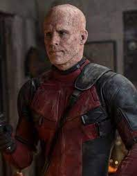
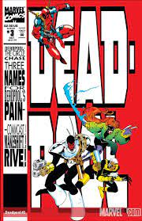

 # deadpool
 
#### Deadpool is een Amerikaanse komische superheldenfilm uit 2016, gebaseerd op het Marvel Comics-personage Deadpool. Het is de achtste film in de X-Men filmserie. De hoofdrollen worden vertolkt door Ryan Reynolds, Morena Baccarin, Ed Skrein, T.J. Miller en Gina Carano. De film ging op 8 februari 2016 in première in Le Grand Rex, Parijs

## Profiel
 
#### Wade Wilson, also known as Deadpool, is a fictional character in 20th Century Fox's X-Men film series and later the Marvel Cinematic Universe (MCU) media franchise produced by Marvel Studios. He is portrayed by Ryan Reynolds and is based on the Marvel Comics character of the same name. The initial, heavily adapted interpretation of the character first appeared in X-Men Origins: Wolverine (2009) as a mutant mercenary and a member of Major William Stryker's black ops military team. Wilson is transformed by Stryker into a genetically altered mutant killer known as Weapon XI, but is defeated by his former teammates Logan and Victor Creed.

## Getuigenissen
 
### Vanessa
#### Eerst was hij mijn man en waren we zeer gellukig samen. Dan werd hij ziek en bleek dit kanker te zijn. Hierdoor verdween hij inneens snachts en zag ik hem een lange tijd niet. Bleek hij een mutant te zijn geworden. Dan zag ik hem opnieuw en ondanks dat zijn uiterlijk veranderde zie ik hem even graag.

 
### Wolverine
#### We kregen zeer veel meldingen van iemand die mense in gevaar bracht. Dus we brachten hem binnen en hij bleek een irritant iemand te zijn. Gellukig deed hij wel de dingen die een held moet doen.

 
### Blind AI
#### Hij was een vriendelijke man of klonk toch zo.Kwam bij mij inwonen een tijd terug en was heel aangenaam kwam alleen wel vuil en laat thuis en soms ook heel vermoeid. Het rare is dat hij soms kleine ledenmaten heeft maar dat heb ik nog niet uitgezocht.

 
### Dopinder
#### Op een normale dag kwam hj binnen in mijn taxi en ging hij veel mense redden. Daarom is hij mijn voorbeeld en heeft hij veel problemen voor mij opgelost. Ik ben zijn favoriete chauffeur en rij hem vaak rond.

## Comics
### The circle Chase (vol.1)
#### August – November 1994
 

### The circle Chase (vol.2)
#### January 1997 – October 2002
 

### The circle Chase (vol.3)
#### November 2008 – December 2012
 

[^1]: Deadpool

footer:Deadpool